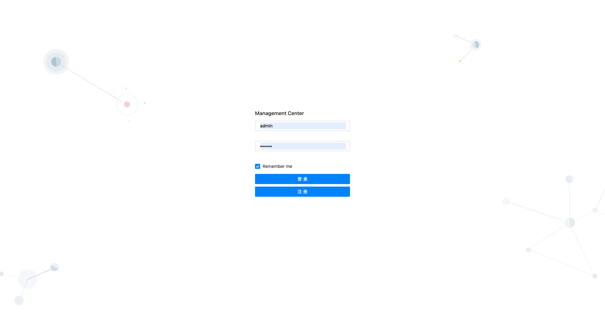

## 目录介绍

```
koa-template (后端项目)

react-template (前端项目)
```

## 预览图




## 技术栈

```
koa-template:
koa + + koa-router + koa-bodyparser + koa-mutler + koa-static-cache  + mongoose +  nodemon(启动热更新)
```

```
react-tempalte:
umi + dva + ant-design-pro + axios + bizcharts
```

## 项目启动步骤

```
1.git clone
2.安装mongodb:https://www.mongodb.com/try/download/community
3.安装 mongodb可视化操作工具:Robomongo或navicat (可选)
具体安装流程可参考：https://note.youdao.com/s/GfIQDbhj
4.启动
cd koa-template
npm run start

cd react-template
npm run start
```

## 注意事项

```
mongodb启动默认端口号是27017,启动看是否被占用
后端项目端口号是3000,可以在koa-template/config.js里面修改

```
